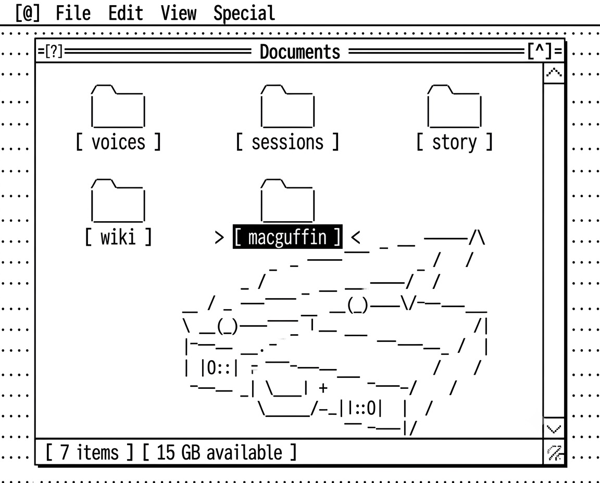

# The MacGuffin App

**A writing tool that prompts you and gives you feedback, instead of writing for you.**

You put up to seven things in a folder. It asks you questions, keeps a wiki of everything you decide, argues with you in several voices, and writes drafts to files you open and change by hand. What comes out is a **treatment** — for a short story, a film, a TV series, a novel, or a theatre play.

One afternoon, or a novel built over months. The same folder does both.

**Called an app because it needs somewhere to live, not because it is one.** An app is something you use. This is closer to an apparatus: you switch it on, and it produces things until you stop it.

**→ [START HERE.md](START%20HERE.md)**

---

## Three things that make it not a prompt

**The terminal never gets long.** Drafts go to files. The terminal says what changed and where, in five lines or fewer. You read the work in your editor, change it there, and your edit outranks anything either of you typed. The interface is your text editor, not a chat window.

**It remembers what you threw away.** Every direction you dropped goes to `wiki/abandoned.md` with your reason, back-linked to the pages it affects. In session five it will not warmly propose the idea you killed in session two. That is the failure that makes people quit long projects with a language model, and it is the main thing this fixes.

**The provocations are derived, not random.** There is no card deck. `lint.sh` counts links and fields across the wiki and reports what the counts imply — two characters who share three themes and have never met, a thread set up and never paid off, a character marked finished who has nothing left to learn. A shell script does the checking, because a check scored by the thing being checked passes every time.

## It also tells you to stop

When there is a lot of talk and no new page — the same section rewritten three times, six turns since anything was written to disk — it sends you outside for twenty minutes, or suggests you close the session and come back tomorrow. It reports what it counted, never how it thinks you feel, and nothing has to come back with you.

## Status

**Not yet run on anyone, including its author.** This is a first release, not a finished tool — the runtime is 3,959 words, kept deliberately small so the whole thing can be read in one sitting. Everything else here is a claim being tested.

Two proto-MacGuffins came before this one and are not published — earlier, heavier attempts that taught the lessons this release is built on. See [What the prototypes taught this one](What%20the%20prototypes%20taught%20this%20one.md) if you want the reflection.

## Runs on

Nobody edits video professionally in MovieMaker; they use DaVinci Resolve or Final Cut, and they learn it. The consumer chat window is the MovieMaker of this moment. This runs in a terminal agent instead, because that's the toolkit you can version, script, and point at whichever model you want.

Claude Code, Msty, OpenCode, or any terminal agent that can read and write files. No installation, no dependencies, one optional shell script. Copy the folder somewhere local first — Drive and Dropbox will overwrite a file mid-session.

## Licence

MIT.
